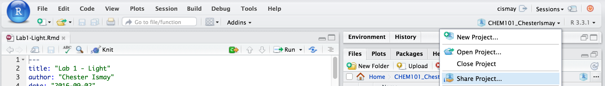
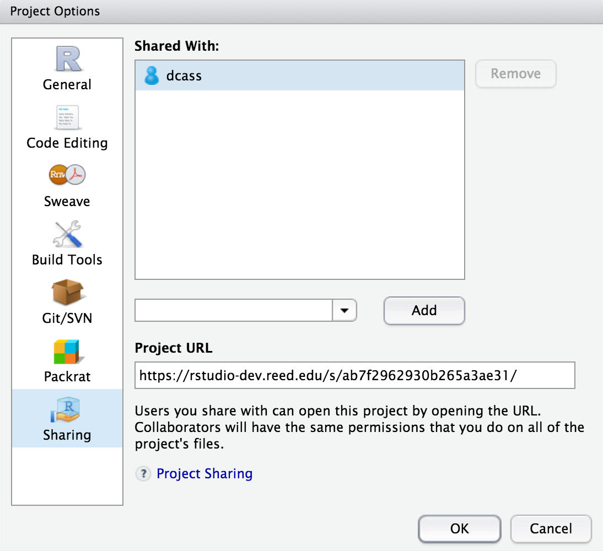

# Lab 2: Beer's Law {#beers}

## Getting the R Markdown lab template

Begin by creating a new folder called `Lab2-Beers` in your `CHEM101_FirstnameLastname` folder. Next, follow steps similar to those found in the GIF in [Section 1.1][Getting the lab template], but select the **Beer's Law** R Markdown template instead of **Light** and save your file in the newly created `Lab2-Beers` folder as `lab2.Rmd`.

## The parts of the lab template

### YAML

Refer back to [The YAML header] section in Chapter \@ref(light) for a review on what the entries here mean.  Remember to be careful with spacing!

### Initial R Chunk

Remember that the `chemistr` package automatically loads in many useful packages for you.  It also includes functions such as `chem_table` you worked with in Lab 1 and `chem_scatter` that you will work with in this lab.

### Directions chunk

Immediately after the `## Data` header, you'll see a chunk of commented R code Danielle has including giving you directions on what the chunks after it should include.  Note that this chunk again uses `include=FALSE` so you won't see any of this in the resulting knitted DOCX file.

### First data chunk

After carefully reading over the commented R code Danielle has added providing you with directions, you now are ready to enter values in for Part A.  Note that you can change the variable names from `Independent1` and `Dependent1` to something else, but remember that those names cannot include spaces or other mathematical objects.  Remember that if you change the name of `Independent1` to, say, `my_indep` that you'll need to make sure to change all references from `Independent1` to `my_indep` in the R code that follows.

### Transforming to a logarithmic scale

We often need to look at data not on our usual scale but instead on a logarithmic scale.  With logarithms we specify a base and you may remember from algebra that logarithms are related to exponential functions.  In this lab, you'll be using "log base 10" and the `log10` function in R.  I recommend you enter `?log10` into the R Console for more information.

One of the powerful features of R is its ability to do vectorized calculations.  Here is an example:

```{r}
my_nums <- c(10, 15, 105, 500, 100231)
log10(my_nums)
```

The code above produces the "log base 10" for each of the values in `my_nums`.  We haven't assigned this to anything though since we didn't include the assignment operator `<-`.  In the GIF below, I'll show you how to create one of the two new variables you'll need to create.  Remember that you'll also need to update your `data_frame` call to include both of your newly created variables as well.

```{r , echo=FALSE, fig.cap="Create log10 variable"}
gif_link("gifs/log.gif")
```

As I have in the GIF, you should use the R Console to check your results in the R chunks by either entering the R code line by line into the Console or by pressing the **Run Current Chunk** button (the green Play button).

### Copying from one chunk into a new chunk

When you are first learning to program, one of the best strategies you can do is to copy working code and make small changes to the code to produce a different result.  In the `plot1` chunk (remember to look at the phrase right after the `{r` and before the comma that begins your R chunk to find the name), you will see how to produce a scatterplot of `Independent1` on the vertical axis and `Dependent1` on the horizontal axis (frequently written as "a scatterplot of `Independent1` versus `Dependent1`---or `y` versus `x`).  In the GIF below, you'll see how we could produce a plot of "log base 10" `Independent1` versus `Dependent1`.  Notice that only a few subtle changes are needed to produce a different plot.  Also think about how the new plot in chunk `plot2` compares to the plot produced in `plot1`.

```{r , echo=FALSE, fig.cap="Copy chunk and make new plot"}
gif_link("gifs/log2.gif")
```

You'll need to use keyboard shortcuts to copy-and-paste code.  (Ctrl + C on a Windows machine or Command + C on a Mac to copy.  Then use Ctrl + V on a Windows machine or Command + V on a Mac to paste.)

### Regression

Carefully note in the GIF how I have updated the variables to produce a new fit and a new plot.  The `lm` function expects `y ~ x` so make sure you have them in the correct order.  In other words, you'll want to have your "independent variable" ~ "dependent variable". This is used to get the coefficients from a straight line regression fit of the data.  The `summary` function produces a lot of important information about this fit.

### The remainder of the lab

In the remaining portions of the lab, you are asked to modify the results above to make 4 additional plots.  Additionally, you'll need to provide commentary text below the Discussion header.

## Note on white space

As you look over the R Markdown document you'll see that there is always a new line of white space between the discussion and the R chunks and also between each of the R chunks.  It is highly recommended that you also follow this workflow.  You'll receive some strange errors at times if you try to stack everything together and it's also much harder to follow for another reader of your document if you have everything bunched together.  **White space is your friend!**

## Spell-check

Just as I'm sure your English teachers have told you to spell check your documents before submitting, you are also encouraged to do so here.  There is a built-in spell check option found near the **Knit** button.  

`r if(knitr:::is_html_output()) knitr::include_graphics("images/spellcheck.png")`

```{r echo=FALSE, out.width='0.3\\textwidth'}
knitr::include_graphics("images/spellcheck.png")
```

Please run this and carefully read over your lab report before converting it to a PDF and submitting it to Moodle.

## Converting your Word document to PDF

The directions for each lab on Moodle say to upload a PDF version of your lab.  You'll see how to create this PDF from inside Microsoft Word for Mac.  A similar procedure can be done using LibreOffice (https://www.libreoffice.org/download/libreoffice-fresh/) on Linux, Mac, or Windows machines or Microsoft Word on a PC.  You may also have the option to **Save As** a PDF there and you can get to this option by going to **File -> Save As -> File Format: -> PDF** on the Mac if you prefer.

```{r , echo=FALSE, fig.cap="Save as PDF on Mac from Microsoft Word"}
gif_link("gifs/word_pdf.gif")
```

## Note on requesting help

It is extremely helpful for us if you can share a link to your RStudio Project in any emails requesting help.  This link is available by going to your RStudio project in the top right corner of RStudio, clicking on it and then selecting **Share Project**, and then select **Sharing** as seen in the screenshots below.

```{r echo=FALSE}

```

```{r echo=FALSE, out.width="60%"}

```

The link is given in the **Project URL**.  Please copy this entire link into the body of your emails to Danielle or I so that we can quickly look into your errors.

