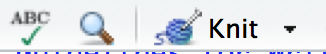

# Lab 4: Iron {#iron}

## Getting the R Markdown lab template

Begin by creating a new folder called `Lab4-Iron` in your `CHEM101_FirstnameLastname` folder. Next, follow steps similar to those found in the GIF in [Section 1.1][Getting the lab template], but select the **Iron Analysis** R Markdown template and save your file in the newly created `Lab4-Iron` folder as `lab4.Rmd`.

## The parts of the lab template

### YAML

Refer back to [The YAML header] section in Chapter \@ref(light) for a review on what the entries here mean.  Remember to be careful with spacing!

### Initial R Chunk

Remember that the `chemistr` package automatically loads in many useful packages for you.  It is loaded here in the `setup` chunk and will need to be loaded in order to complete the plots in this lab. 

### Results chunk

As with previous labs, here you'll enter the values for `Iron` and `Absorbance` and create a data frame named `iron_data` that pairs these two vectors together.  Remember that `Iron` and `Absorbance` must be of the same length (have the same number of values) for the `data_frame` function to work.

### Plot chunk

We are interested in fitting a linear regression line using `Iron` as our predictor variable and `Absorbance` as our response variable here.  Make sure to add labels to your plots and include an appropriate figure caption in the R chunk option `fig.cap` following the guidelines in the commented R code in the `plot1` chunk.

### Calculations

In this block of code you'll be doing some statistical calculations.  If you'd like to use R to do so, you'll need to first download the data file from Moodle and read it into an object in R.  So, for example, if the data was saved as a CSV file called `iron_class.csv`, you could use the following code after you have Uploaded the file onto your directory on the RStudio Server.

```{r eval=FALSE}
iron_class <- read.csv("iron_class.csv")
```

Now that you have the data read in, you can use the `group_by`, `summarize`, and `mutate` functions in R to calculate averages, standard deviations, and confidence intervals.  If the name of our iron variable for the class is `iron`, we can use the `summarize` function to calculate the **mean** (average), **standard deviation**, and **n** (how many values are in our sample).  We can then use the `mutate` function to create new columns corresponding to the lower value of the confidence interval and the upper value of the confidence interval:

```{r eval=FALSE}
iron_class %>%
  summarize(mean.iron = mean(iron, na.rm = TRUE),
            sd.iron = sd(iron, na.rm = TRUE),
            n.iron = n()) %>%
  mutate(se.iron = sd.iron / sqrt(n.iron),
         lower.ci.iron = mean.iron - qt(1 - (0.1 / 2), n.iron - 1) * se.iron,
         upper.ci.iron = mean.iron + qt(1 - (0.1 / 2), n.iron - 1) * se.iron)
```

To review, the `iron_class` data frame is passed into the `summarize` function, which creates three new variables `mean.iron`, `sd.iron`, and `n.iron`.  We need to determine `n.iron` in order to calculate the standard error denoted as `se.iron`.  We can then put it all together to calculate the confidence interval.  Note here that instead of looking up the values in the $t$ table we can have R look them up for us at the 90% level (this corresponds to the 95^th^ percentile value in the $t$ distribution with `n.iron - 1` degrees of freedom).

### The remainder of the lab

Lastly, you'll need to include a picture of your calculations if you didn't use R and also a discussion of your results following the directions in the template.

## Note on white space

As you look over the R Markdown document you'll see that there is always a new line of white space between the discussion and the R chunks and also between each of the R chunks.  It is highly recommended that you also follow this workflow.  You'll receive some strange errors at times if you try to stack everything together and it's also much harder to follow for another reader of your document if you have everything bunched together.  **White space is your friend!**

## Spell-check

Just as I'm sure your English teachers have told you to spell check your documents before submitting, you are also encouraged to do so here.  There is a built-in spell check option found near the **Knit** button.  

`r if(knitr:::is_html_output()) knitr::include_graphics("images/spellcheck.png")`

```{r echo=FALSE, out.width='0.3\\textwidth'}

```

Please run this and carefully read over your lab report before converting it to a PDF and submitting it to Moodle.

## Converting your Word document to PDF

The directions for each lab on Moodle say to upload a PDF version of your lab.  You'll see how to create this PDF from inside Microsoft Word for Mac.  A similar procedure can be done using LibreOffice (https://www.libreoffice.org/download/libreoffice-fresh/) on Linux, Mac, or Windows machines or Microsoft Word on a PC.  You may also have the option to **Save As** a PDF there and you can get to this option by going to **File -> Save As -> File Format: -> PDF** on the Mac if you prefer.

```{r , echo=FALSE, fig.cap="Save as PDF on Mac from Microsoft Word"}
gif_link("gifs/word_pdf.gif")
```

## Note on requesting help

It is extremely helpful for us if you can share a link to your RStudio Project in any emails requesting help.  This link is available by going to your RStudio project in the top right corner of RStudio, clicking on it and then selecting **Share Project**, and then select **Sharing** as seen in the screenshots below.

```{r echo=FALSE}
knitr::include_graphics("screenshots/shareproj1.png")
```

```{r echo=FALSE, out.width="60%"}
knitr::include_graphics("screenshots/shareproj2.png")
```

The link is given in the **Project URL**.  Please copy this entire link into the body of your emails to Danielle or I so that we can quickly look into your errors.


