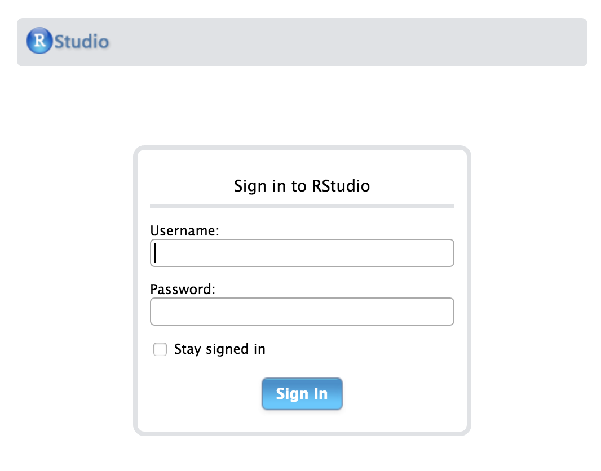
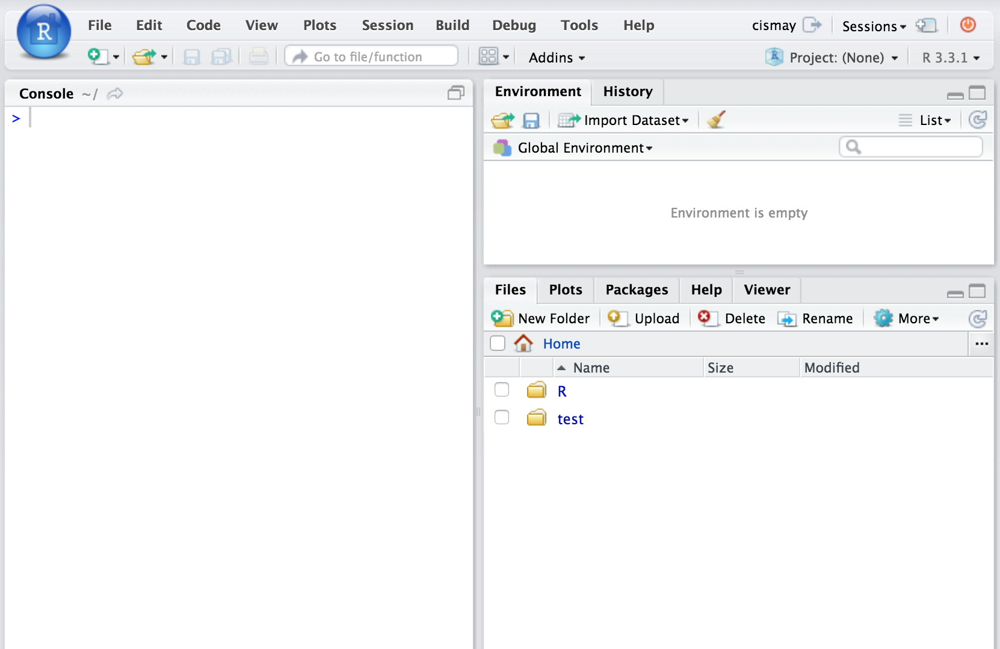

--- 
title: "LeaRning R in ChemistRy at Reed College"
author: "Chester Ismay"
date: "`r Sys.Date()`"
knit: bookdown::render_book
site: bookdown::bookdown_site
documentclass: book
bibliography: [bib/books.bib, bib/packages.bib, bib/articles.bib]
biblio-style: apalike
link-citations: yes
github-repo: ismayc/chemistr-book-source
description: "A help manual for working with RStudio and R Markdown in completing labs for Chem 101/102 at Reed College"
---

```{r setup, include=FALSE}
options(width = 72)
knitr::opts_chunk$set(tidy = FALSE, fig.align = "center", out.width = '\\textwidth')
# automatically create a bib database for R packages
knitr::write_bib(c(
  .packages(), 'bookdown', 'devtools'
), 'bib/packages.bib')

gif_link <- function(path, latex = knitr:::is_latex_output()){
  webpage <- "https://raw.githubusercontent.com/ismayc/chemistr-book/master/"
  if(latex){
    knitr::asis_output(paste0('\\vspace{0.1in}',
                              '\\begin{center}', 
                              '\\footnotesize{\\url{', webpage, path, '}}',
                              '\\end{center}',
                              '\\vspace{0.1in}'))
  } else{
    knitr::include_graphics(path)
  }
}
```


# Introduction {-}

## What is this? {-}

In the HTML version of this book, you can also download the PDF version of the book by clicking on PDF button in the top toolbar of the page.  HTML is the preferred format but the PDF format may be preferred for some readers.  Links to the different GIFs directly found in the HTML version are provided in the PDF version.

This resource is designed to assist students in CHEM 101/102 in using RStudio and R Markdown to complete their labs.  (A more general reference to the specifics of R, RStudio and R Markdown is available in a different free book [here](http://ismayc.github.io/rbasics-book) [@usedtor2016]).  This resource will show you GIFs explaining how to do some common procedures you'll need to do to complete labs.  In addition, it will provide more details about the specifics of the different lab templates available in the `chemistr` R package.  Each chapter of this book will correspond to each of the different labs.  

Lastly, if you are interested, you'll find instructions on how to complete the labs using RStudio Desktop instead of the RStudio Server in the Appendix.  The Appendix will also include descriptions of the code that is sitting "behind the scenes" in many of the functions created in the `chemistr` package:  `chem_table`, `chem_scatter`, `chem_clustered.bar`, etc.  These functions were written to ease a beginner into working with R.  Those interested in customizing their lab reports further should look over the R code in the Appendix.  Additionally, many of the needed packages are automatically loaded when the `chemistr` package is loaded using `library(chemistr)`.  You'll see how each of these packages is used in the Appendix.

If further clarification is needed on any other aspect of the book, please email [me](mailto:cismay@reed.edu) with a reference to the error/area where more guidance is necessary.  More advanced users are encouraged to create a GitHub issue [here](https://github.com/ismayc/chemistr-book/issues).  Pull requests on GitHub for typos or improvements are also welcome and you can easily do so by clicking on the Edit button near Search at the top of the HTML version of the book.

This book will evolve and be updated as needed based on feedback.  You can always check the date at the end of the chapter to see when the book was last updated.  It is recommended that you use Google Chrome as your browser since GIFs sometimes do not load automatically with other browsers.

## Starting the labs {-}

### Logging in and initial screen {-}

The RStudio Server provides a web-based way to run analyses in R.  This means that you will only need an internet connection and a web browser to run your analyses.  You can be running a Windows machine, a Mac, a Linux, or pretty much any other device that has access to the internet and a web browser.  If you are interested in using the Reed College RStudio Server off campus, you'll need to request access in the form [here](https://docs.google.com/a/reed.edu/forms/d/e/1FAIpQLSftEFv1v-GAwrH4fy-eIoToHBybWyXRSJUwk-NKHU6-Gn5Q6g/viewform).  The initial login page will not load for you unless you are connected to the VPN from off campus locations.  After entering the link (<http://rstudio-dev.reed.edu>) into your browser, you'll see a page that looks something like:

```{r serverlogin, echo=FALSE, out.width="50%"}

```

After logging in with your Reed College username (mine is `cismay`, for example) and password, you should see a layout similar to what follows.

```{r initialrstudio, echo=FALSE, out.width="70%"}

```

### Creating and Sharing Projects using RStudio Server {-}

A good habit to get into whenever you start a new project following a common theme (such as your CHEM 101 labs) with R code is to create a new RStudio project to go along with it.  RStudio project files have the extension `.Rproj` and store metadata that goes along with the documents you've saved and information about the R environment you are working in. More information about RStudio projects is available from RStudio, Inc. [here](https://support.rstudio.com/hc/en-us/articles/200526207-Using-Projects).

You'll be sharing your Chem 101 labs with your Danielle Cass (`dcass`) and Chester Ismay (`cismay`) using the RStudio Server.  This will allow both of us to help you with errors you may be having in writing your lab report without having to email files back and forth.  You'll just need to email us with the name of the lab you are having troubles with and what you named your RStudio project and we'll be able to go in and look over your R Markdown file.  You can think of this as working somewhat like Google Docs in that both Danielle and I can provide feedback and walk-through your analyses. 

To share the project with us, you should follow along with the example below.  Instead of naming your RStudio project `CHEM101_ChesterIsmay` as the GIF shows, you should name it `CHEM101_YourName` where `YourName` is replaced with your first and last names.  Spaces can cause problems in file names so it is recommended that you avoid them.  If you've already shared your project and you have spaces in the name, you'll probably be OK, but try to avoid spaces in your file names going forward.  Calling your project `CHEM101_YourName` will allow Danielle and I to track down your project more easily than if everyone named their project `initial` or something similar.

```{r projshare, echo=FALSE}
gif_link("gifs/proj_share.gif")
```

You'll need to also add `cismay` as someone you'd like to share the project with.  You can do so by entering my username immediately after you have clicked **Add** to add Danielle or you can go back to **Share Project** and enter my name there just as you have with `dcass`.  If you see that your project is shared with both `dcass` and `cismay`, you have completed this stage successfully.

You'll see at the beginning of each chapter corresponding to the labs how you can access the different R Markdown template files for each lab.  These template files are built into the `chemistr` package that I have already loaded on the Reed RStudio Server for you. ^[If you are completing the labs using RStudio Desktop, you'll see instructions on how to install this package onto your computer in the Appendix.  After installing the package, you'll be able to use the R Markdown templates in much the same way students using the RStudio Server can.  Note that if you are using the RStudio Desktop, you won't have access to the Shared Projects feature and it will be more difficult for Danielle and I to help you.]    

## Requesting help {-}

It's nearly impossible for Danielle and I to help you unless we know that you are having troubles.  If you find yourself unable to complete a lab because of problems with RStudio and you've spent more than 30 minutes trying to figure it out, it is time for you to stop and ask for help.  We encourage you to try to figure it out on your own as much as possible because this helps you learn, but if you are deeply entrenched in not getting R to work, that could be taking away from your learning of Chem 101/102 material.

We encourage you to reach out to both of us and carefully explain what is going wrong with your R Markdown file.  Sending us an email saying "I can't get it to work, please help." is not insightful and won't help you learn in the long-run.  Be as descriptive as possible.  Something like what follows is much preferred: \vspace{0.1in}

> "I'm receiving an error on line 46 of my Light lab about not finding an object.  I've tried Googling it and found a couple references about it including **link1** and **link2** but it's not working for me."

\vspace{0.1in}

This tells us that you have tried to figure it out for yourself, but that you require our assistance.  That is to be expected and you shouldn't be discouraged if you don't understand something about R Markdown immediately.  

We are here to help and please don't give up on this.  Learning how to work with R even at the most basic of levels will help you long-term in keeping track of analyses and getting you on the path to reproducible research.  This will help you in your academic careers and whatever you do after your academic career ends. If you need assistance, please email [Danielle](dcass@reed.edu) and [Chester](cismay@reed.edu) with your concise error specifying in which lab and what the name of your RStudio project is.  We are happy to help you learn how to use R!

### Book was last updated: {-}

```{r echo=FALSE}
paste("By", Sys.info()[["user"]], "on", format(Sys.time(), "%A, %B %d, %Y %X %Z"))
```